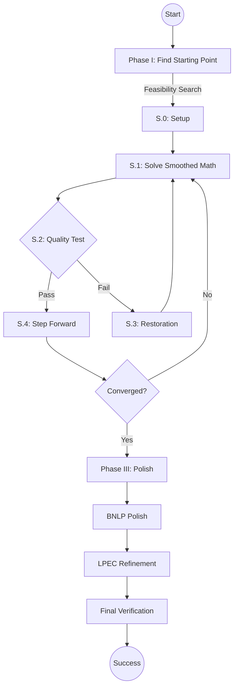

# MPECSS: A Smart Solver for Complex Optimization

[](https://pypi.org/project/mpecss/)
[](https://www.python.org/)
[](LICENSE)

---

## What is MPECSS?

Imagine you have a difficult math problem where you need to find the best balance between two opposing forces (like traffic flow vs. road capacity) but there's a catch: for every decision, one of two conditions **must** be zero. These are called "Equilibrium Constraints," and they are notoriously hard for computers to solve.

**MPECSS** is a specialized tool that "smooths out" these hard catches, making it easier for standard math solvers to find the best possible solution.

### Why use it?
- **Real-world power**: Used in traffic planning, electricity markets, and friction modeling.
- **Smart Fallbacks**: If the primary method gets stuck, MPECSS has a "Phase III" safety net to find a valid solution.
- **Trusted Results**: It checks its own work to tell you if the solution is "S-stationary" (the best) or "B-stationary" (a solid, reliable alternative).

---

## Official Benchmark Workflow

Official benchmark runs are maintained through the Kaggle notebooks in `kaggle_setup/`.

### 1. Open Kaggle
Create a new notebook and add the dataset `mrsaurabhtanwar/mpecss-benchmarks`.

### 2. Pick the notebook that matches your run

**Main benchmark notebooks**
- `kaggle_setup/MPECSS_Kaggle_MPECLib.ipynb`
- `kaggle_setup/MPECSS_Kaggle_MacMPEC.ipynb`
- `kaggle_setup/MPECSS_Kaggle_NosBench_Group1.ipynb`
- `kaggle_setup/MPECSS_Kaggle_NosBench_Group2.ipynb`
- `kaggle_setup/MPECSS_Kaggle_NosBench_Group3.ipynb`
- `kaggle_setup/MPECSS_Kaggle_NosBench_Group4.ipynb`
- `kaggle_setup/MPECSS_Kaggle_NosBench_Group5.ipynb`
- `kaggle_setup/MPECSS_Kaggle_NosBench_Group6.ipynb`

**MacMPEC ablation notebooks**
- `kaggle_setup/MPECSS_Kaggle_MacMPEC_Ablation_NoPhaseI.ipynb`
- `kaggle_setup/MPECSS_Kaggle_MacMPEC_Ablation_FixedPhaseII.ipynb`

**MacMPEC seed-robustness notebooks**
- `kaggle_setup/MPECSS_Kaggle_MacMPEC_SeedRobustness_Seed11.ipynb`
- `kaggle_setup/MPECSS_Kaggle_MacMPEC_SeedRobustness_Seed42.ipynb`
- `kaggle_setup/MPECSS_Kaggle_MacMPEC_SeedRobustness_Seed123.ipynb`

**MacMPEC parameter-sensitivity notebooks**
- `kaggle_setup/MPECSS_Kaggle_MacMPEC_ParamSensitivity_t0_0p1.ipynb`
- `kaggle_setup/MPECSS_Kaggle_MacMPEC_ParamSensitivity_t0_1.ipynb`
- `kaggle_setup/MPECSS_Kaggle_MacMPEC_ParamSensitivity_t0_10.ipynb`
- `kaggle_setup/MPECSS_Kaggle_MacMPEC_ParamSensitivity_kappa_0p3.ipynb`
- `kaggle_setup/MPECSS_Kaggle_MacMPEC_ParamSensitivity_kappa_0p5.ipynb`
- `kaggle_setup/MPECSS_Kaggle_MacMPEC_ParamSensitivity_kappa_0p8.ipynb`

The Kaggle-specific guide is in `kaggle_setup/README.md` and `kaggle_setup/QUICK_START.md`. Each notebook installs the package in editable mode, runs `scripts/preflight_checks.py`, and calls `kaggle_setup/resumable_benchmark.py` to write outputs to `/kaggle/working/outputs`, including a compact version note JSON.

---

## Installation & Setup

### Local Installation (Development)

1. **Clone the repository**
   ```bash
   git clone https://github.com/mrsaurabhtanwar/MPECSS.git
   cd MPECSS
   ```

2. **Create and activate a virtual environment**
   ```bash
   python -m venv .venv
   .\.venv\Scripts\Activate.ps1  # PowerShell on Windows
   # or: source .venv/bin/activate  # macOS/Linux
   ```

3. **Install the package in editable mode**
   ```bash
   python -m pip install --upgrade pip
   python -m pip install -e .
   ```

4. **Install the test extra when you need pytest**
   ```bash
   python -m pip install -e ".[test]"
   ```

5. **Verify installation**
   ```bash
   # Check installed version
   python -c "import mpecss; print(mpecss.__version__)"

   # Run full preflight checks (optional)
   python scripts/preflight_checks.py
   ```

### PyPI Installation (Stable)

```bash
python -m pip install mpecss
```

---

## How to Solve Your First Problem

You can solve a problem in just a few lines of code:

```python
from mpecss import run_mpecss
from mpecss.helpers import load_macmpec

# 1. Load a pre-defined problem
problem = load_macmpec("benchmarks/macmpec/macmpec-json/dempe.nl.json")

# 2. Pick a starting point
z0 = problem["x0_fn"](seed=42)

# 3. Solve it!
result = run_mpecss(problem, z0=z0)

print(f"Status: {result['status']}")
print(f"Result: {result['f_final']:.6f}")
```

## Dependencies

`pyproject.toml` defines the install metadata. `requirements.txt` mirrors the same runtime stack for direct installs.

**Runtime dependencies**
- `casadi >= 3.6.3` - Symbolic computation and automatic differentiation
- `numpy >= 1.24` - Numerical computing
- `scipy >= 1.11` - Scientific computing utilities
- `pandas >= 2.0` - Data handling and analysis
- `matplotlib >= 3.7` - Plotting for trace visualization
- `psutil >= 5.9` - System introspection used by benchmark runs

**Test extra**
- `pytest >= 7.4` - Unit testing framework

**Python version:** 3.10 or higher

---

## Development

### Running Tests

```bash
pytest tests/
```

### Running Preflight Checks

```bash
python scripts/preflight_checks.py
```

### Documentation

Detailed workflow diagrams and documentation are available in `docs/`:
- `WORKFLOW_DIAGRAMS.md` - Algorithm flow documentation
- `diagram_a_overview.mmd` - High-level overview
- `diagram_b_phase12.mmd` - Phase I & II details
- `diagram_c_phase3.mmd` - Phase III flow

---

## Running Benchmarks (886 Problems)

MPECSS ships three benchmark suites:

- **MPECLib**: 92 problems
- **MacMPEC**: 191 problems
- **NosBench**: 603 problems split across six Kaggle notebooks (101 / 101 / 101 / 100 / 100 / 100)

The supported path is the Kaggle notebooks under `kaggle_setup/`. Each notebook clones the repository, installs the package in editable mode, runs `scripts/preflight_checks.py`, and calls `kaggle_setup/resumable_benchmark.py` to write artifacts to `/kaggle/working/outputs` plus the version note JSON.

MacMPEC also includes three study notebooks for ablation, seed robustness, and parameter sensitivity experiments.

---

## Understanding the Solver Output

| Status | What it means |
| :--- | :--- |
| **S-stationary** | ✅ Perfect! The solver found the best possible stationary point. |
| **B-stationary** | ✅ Good! A solid, mathematically verified solution. |
| **Failed** | ❌ The problem was too complex to solve this time. |

---

## Project Structure

```
.
├── mpecss/                 # Solver package
│   ├── helpers/            # Loaders, solver wrappers, and utilities
│   ├── phase_1/            # Phase I: Feasibility and starting point
│   ├── phase_2/            # Phase II: Main solver loop
│   └── phase_3/            # Phase III: Polishing and verification
├── benchmarks/             # MPECLib, MacMPEC, and NosBench JSON suites
├── kaggle_setup/           # Kaggle notebooks, runner, and helpers
├── scripts/                # Utility scripts such as preflight checks
├── docs/                   # Workflow diagrams and supporting docs
├── verification/           # Reference results and regression baselines
├── results/                # Generated solver outputs
├── tests/                  # Unit tests
├── paper/                  # Paper and supporting materials
├── pyproject.toml          # Packaging metadata and dependencies
├── requirements.txt        # Mirror of runtime dependencies
└── LICENSE                 # Apache 2.0 License
```

---

## Detailed Algorithm Flow



---

## Citation & Contact

If you use this work, please cite:
```bibtex
@article{saurabh2026mpecss,
  title={MPECSS: Scholtes regularization with adaptive paths for MPECs},
  author={Saurabh and Singh, Kunwar Vijay Kumar},
  journal={Optimization Methods and Software},
  year={2026}
}
```

**Need Help?**
- Open an issue on [GitHub](https://github.com/mrsaurabhtanwar/MPECSS/issues)
- Email: `27098@arsd.du.ac.in`

---
License: Apache 2.0
