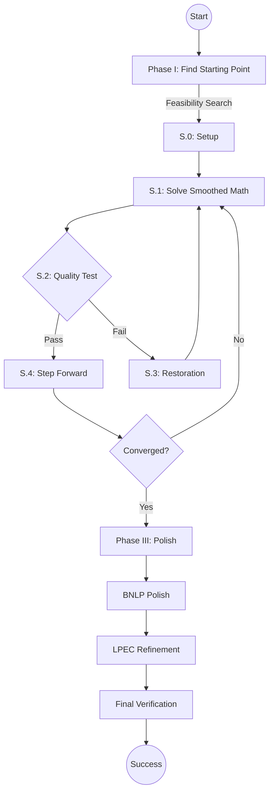

# MPECSS: A Smart Solver for Complex Optimization

[](https://pypi.org/project/mpecss/)
[](https://www.python.org/)
[](LICENSE)

---

## What is MPECSS?

Imagine you have a difficult math problem where you need to find the best balance between two opposing forces (like traffic flow vs. road capacity) but there's a catch: for every decision, one of two conditions **must** be zero. These are called "Equilibrium Constraints," and they are notoriously hard for computers to solve.

**MPECSS** is a specialized tool that "smooths out" these hard catches, making it easier for standard math solvers to find the best possible solution.

### Why use it?
- **Real-world power**: Used in traffic planning, electricity markets, and friction modeling.
- **Smart Fallbacks**: If the primary method gets stuck, MPECSS has a "Phase III" safety net to find a valid solution.
- **Trusted Results**: It checks its own work to tell you if the solution is "S-stationary" (the best) or "B-stationary" (a solid, reliable alternative).

---

## Quick Installation

### 1. For Most Users (Easy Mode)
Simply install it like any other Python package:

```bash
pip install mpecss
```

### 2. For Researchers (Developer Mode)
If you want to help develop the code or see exactly how it works:

```bash
git clone https://github.com/mrsaurabhtanwar/MPECSS.git
cd MPECSS
pip install -e .
```

---

## How to Solve Your First Problem

You can solve a problem in just a few lines of code:

```python
from mpecss.helpers.loaders.macmpec_loader import load_macmpec
from mpecss.phase_2.mpecss import run_mpecss

# 1. Load a pre-defined problem
problem = load_macmpec("benchmarks/macmpec/macmpec-json/dempe.nl.json")

# 2. Pick a starting point
z0 = problem["x0_fn"](seed=42)

# 3. Solve it!
result = run_mpecss(problem, z0=z0)

print(f"Status: {result['status']}")
print(f"Result: {result['f_final']:.6f}")
```

---

## Running Benchmarks (886 Problems)

MPECSS comes with a massive test suite of 886 problems to prove it works.

### Setup Benchmark Data
1. Download `benchmarks.zip` from our [GitHub Releases](https://github.com/mrsaurabhtanwar/MPECSS/releases).
2. Extract it into your project folder. **Do not rename the folder.**

### Run the Tests
We provide simple commands to run all tests at once:

```bash
# Run all three suites sequentially (safe default: 1 worker each)
mpecss-all-benchmarks --workers 1

# Run the MacMPEC suite (191 problems)
mpecss-macmpec --workers 4

# Run the MPECLib suite (92 problems)
mpecss-mpeclib --workers 4

# Run the NOSBENCH suite (603 problems)
mpecss-nosbench --workers 4
```

Before large benchmark runs, use:

```bash
mpecss-preflight
```

---

## Understanding the Solver Output

| Status | What it means |
| :--- | :--- |
| **S-stationary** | ✅ Perfect! The solver found the best possible stationary point. |
| **B-stationary** | ✅ Good! A solid, mathematically verified solution. |
| **Failed** | ❌ The problem was too complex to solve this time. |

---

## Simplified Project Layout

- **`mpecss/`**: The core brain of the solver.
  - `phase_1/`: Finding a good starting point.
  - `phase_2/`: The main solving logic.
  - `phase_3/`: Polishing and verifying the results.
- **`benchmarks/`**: The massive collection of test problems.
- **`scripts/`**: Useful tools for running large-scale tests.
- **`results/`**: Where the solver saves its answers.

---

## Detailed Algorithm Flow



---

## Citation & Contact

If you use this work, please cite:
```bibtex
@article{saurabh2026mpecss,
  title={MPECSS: Scholtes regularization with adaptive paths for MPECs},
  author={Saurabh and Singh, Kunwar Vijay Kumar},
  journal={Optimization Methods and Software},
  year={2026}
}
```

**Need Help?**
- Open an issue on [GitHub](https://github.com/mrsaurabhtanwar/MPECSS/issues)
- Email: `27098@arsd.du.ac.in`

---
License: Apache 2.0
