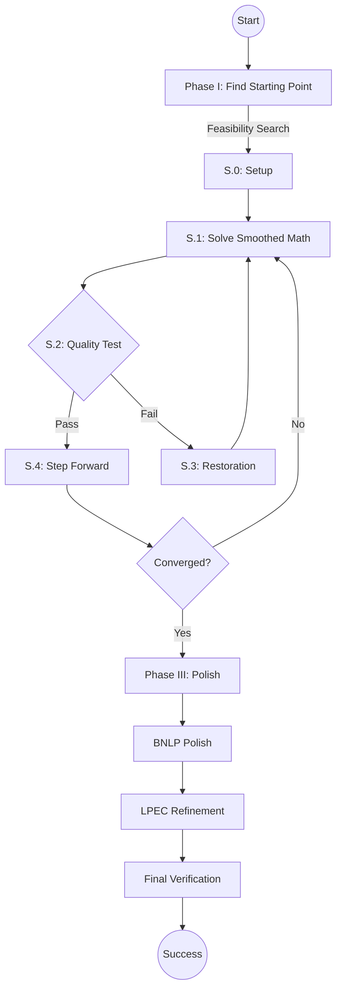

# MPECSS: A Smart Solver for Complex Optimization

[](https://pypi.org/project/mpecss/)
[](https://www.python.org/)
[](LICENSE)

---

## What is MPECSS?

Imagine you have a difficult math problem where you need to find the best balance between two opposing forces (like traffic flow vs. road capacity) but there's a catch: for every decision, one of two conditions **must** be zero. These are called "Equilibrium Constraints," and they are notoriously hard for computers to solve.

**MPECSS** is a specialized tool that "smooths out" these hard catches, making it easier for standard math solvers to find the best possible solution.

### Why use it?
- **Real-world power**: Used in traffic planning, electricity markets, and friction modeling.
- **Smart Fallbacks**: If the primary method gets stuck, MPECSS has a "Phase III" safety net to find a valid solution.
- **Trusted Results**: It checks its own work to tell you if the solution is "S-stationary" (the best) or "B-stationary" (a solid, reliable alternative).

---

## Official Benchmark Workflow

Official benchmark runs are maintained through the Kaggle notebooks in `kaggle_setup/`.

### 1. Open Kaggle
Create a new notebook and add the dataset `mrsaurabhtanwar/mpecss-benchmarks`.

### 2. Import the Notebook You Need
- `kaggle_setup/MPECSS_Kaggle_MPECLib.ipynb`
- `kaggle_setup/MPECSS_Kaggle_MacMPEC.ipynb`
- `kaggle_setup/MPECSS_Kaggle_NosBench_Group1.ipynb`
- `kaggle_setup/MPECSS_Kaggle_NosBench_Group2.ipynb`
- `kaggle_setup/MPECSS_Kaggle_NosBench_Group3.ipynb`
- `kaggle_setup/MPECSS_Kaggle_NosBench_Group4.ipynb`

The Kaggle-specific guide is in `kaggle_setup/README.md` and `kaggle_setup/QUICK_START.md`.

---

## How to Solve Your First Problem

You can solve a problem in just a few lines of code:

```python
from mpecss.helpers.loaders.macmpec_loader import load_macmpec
from mpecss.phase_2.mpecss import run_mpecss

# 1. Load a pre-defined problem
problem = load_macmpec("benchmarks/macmpec/macmpec-json/dempe.nl.json")

# 2. Pick a starting point
z0 = problem["x0_fn"](seed=42)

# 3. Solve it!
result = run_mpecss(problem, z0=z0)

print(f"Status: {result['status']}")
print(f"Result: {result['f_final']:.6f}")
```

---

## Running Benchmarks (886 Problems)

MPECSS comes with a massive test suite of 886 problems to prove it works.

### Supported Path
Use the Kaggle notebooks under `kaggle_setup/`. Each notebook:

- clones the pinned repository revision
- runs `scripts/preflight_checks.py`
- launches `kaggle_setup/resumable_benchmark.py`
- writes outputs to `/kaggle/working/outputs`

NosBench is split across four Kaggle notebooks so the full 603-problem run fits within Kaggle's time limits.

---

## Understanding the Solver Output

| Status | What it means |
| :--- | :--- |
| **S-stationary** | ✅ Perfect! The solver found the best possible stationary point. |
| **B-stationary** | ✅ Good! A solid, mathematically verified solution. |
| **Failed** | ❌ The problem was too complex to solve this time. |

---

## Simplified Project Layout

- **`mpecss/`**: The core brain of the solver.
  - `phase_1/`: Finding a good starting point.
  - `phase_2/`: The main solving logic.
  - `phase_3/`: Polishing and verifying the results.
- **`benchmarks/`**: The massive collection of test problems.
- **`kaggle_setup/`**: Kaggle notebooks and helper scripts for official benchmark runs.
- **`results/`**: Where the solver saves its answers.

---

## Detailed Algorithm Flow



---

## Citation & Contact

If you use this work, please cite:
```bibtex
@article{saurabh2026mpecss,
  title={MPECSS: Scholtes regularization with adaptive paths for MPECs},
  author={Saurabh and Singh, Kunwar Vijay Kumar},
  journal={Optimization Methods and Software},
  year={2026}
}
```

**Need Help?**
- Open an issue on [GitHub](https://github.com/mrsaurabhtanwar/MPECSS/issues)
- Email: `27098@arsd.du.ac.in`

---
License: Apache 2.0
